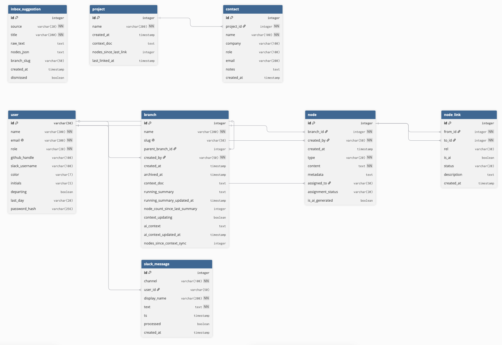
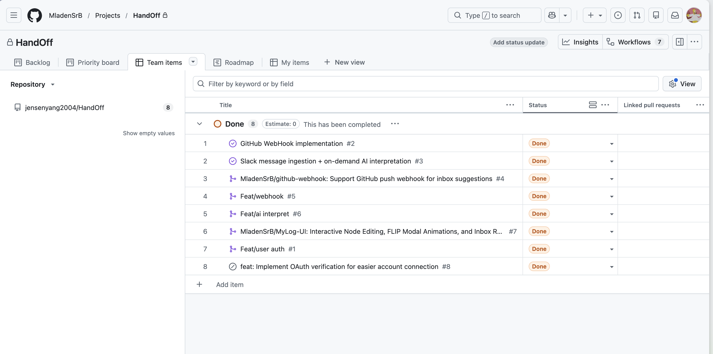
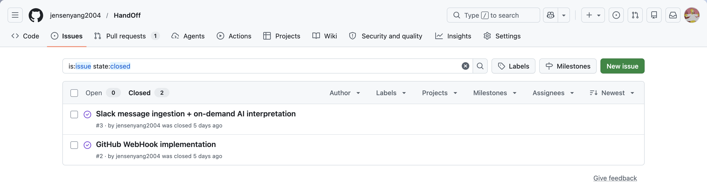
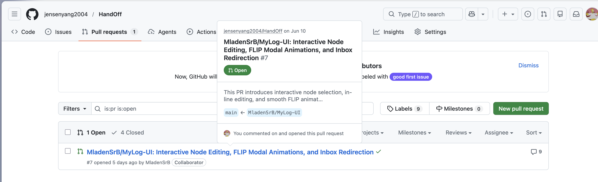
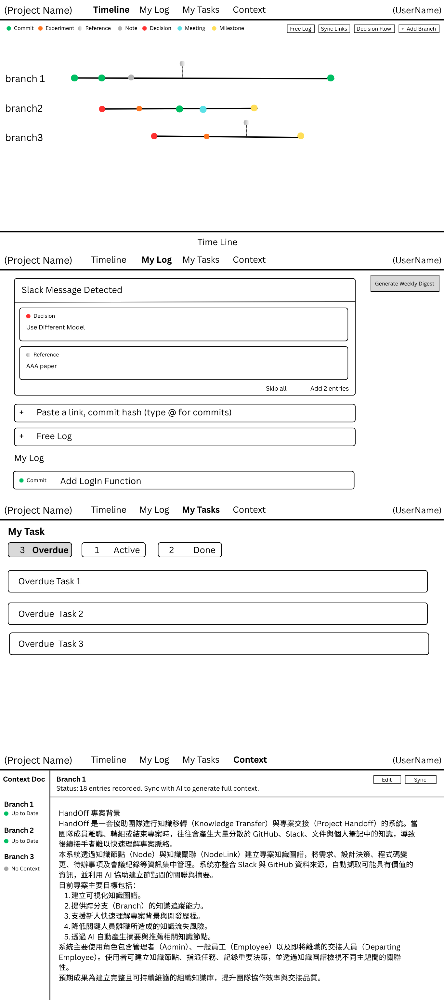

### 啟動專案

-  快速啟動 (for MacOS)
```bash
./run.sh
```
如果無法啟動，請參照以下步驟

- 手動啟動
1. 建立 Python virtual environment

```bash
python -m venv .venv
```

2. 啟用 virtual environment

macOS / Linux：

```bash
. .venv/bin/activate
```

Windows PowerShell：

```powershell
.venv\Scripts\Activate.ps1
```

3. 安裝套件

```bash
pip install -r requirements.txt
```

4. 設定環境變數

在專案根目錄建立 `.env`：

```bash
GEMINI_API_KEY=your_gemini_api_key
SLACK_SIGNING_SECRET=your_slack_signing_secret
DATABASE_URL=sqlite:///handoff.db
```

最小可啟動版本可以只放：

```bash
DATABASE_URL=sqlite:///handoff.db
```

如果沒有 `GEMINI_API_KEY`，AI 相關功能仍會有 mock fallback，但不會是真實 Gemini 結果。

5. 啟動伺服器

```bash
python app.py
```

啟動後打開：

```text
http://localhost:5001
```

# HandOff

HandOff 是一套「專案交接與工程知識管理系統」。它的目標是把團隊平常散落在 commit、Slack、筆記、決策間的連結與任務中的資訊整理成可追蹤的分支時間軸，最後可以產生交接報告，降低成員離開或輪調時的知識流失。

這份 README 主要說明：

- 系統架構
- 程式碼結構
- EER Diagram
- 主要功能
- 如何啟動網站
- 功能設定說明
- Open API documentation
- AI Documentation
- 測試
- 補充文件
- User Stories Mapping
- Low fidelity Wireframes


## 系統架構

本專案是簡單的全端網站，主要由四層組成：

```text
Browser 使用者畫面
    ↓
Frontend React
    ↓
Backend Flask API
    ↓
SQLite Database
```

AI 服務不是獨立伺服器，而是由後端 Flask 在需要時呼叫 Gemini API。

```text
Frontend
    ↓ fetch API
Flask Backend
    ↓ read/write
SQLite Database
    ↓ when needed
Gemini AI API
```

## 程式碼結構

```text
HandOff/
├── app.py                    # Flask 後端入口，所有 API route 主要都在這裡
├── models.py                 # SQLAlchemy 資料庫模型
├── ai_service.py             # Gemini AI 呼叫與 prompt 設計
├── seed.py                   # 初始化 demo 資料
├── verify_ai.py              # AI service 驗證腳本（獨立執行）
├── requirements.txt          # Python 套件需求
├── run.sh                    # 一鍵啟動前後端的 shell 腳本
├── handoff.db                # 本機 SQLite 資料庫
├── frontend/                 # 主要前端程式
│   ├── index.html            # 前端 HTML 入口
│   ├── app.jsx               # 前端主 App（路由與頁面切換）
│   ├── api.js                # 前端呼叫後端 API 的統一介面
│   ├── timeline.jsx          # Timeline 畫面（branch 時間軸與 node 管理）
│   ├── personal-log.jsx      # My Log / Inbox 畫面
│   ├── handover.jsx          # Handover report 畫面
│   ├── manager-dashboard.jsx # Manager dashboard（任務總覽）
│   ├── context.jsx           # Branch context 面板
│   ├── task-list.jsx         # 任務列表元件
│   ├── tweaks-panel.jsx      # Node 編輯面板
│   ├── icons.jsx             # 共用 icon 元件
│   └── styles.css            # 前端樣式
├── docs/                     # 補充規格文件與圖表
│   ├── ERD.png               # EER Diagram
│   ├── wireframe.png         # Low-fidelity wireframe
│   ├── openapi.yaml          # OpenAPI 3.0 規格文件
│   ├── spec.md               # 系統規格與 context architecture
│   ├── webhook-spec.md       # GitHub webhook 規格
│   ├── slack-webhook-spec.md # Slack webhook 規格
│   └── link_feat.md          # Decision linking 功能筆記
└── test/                     # pytest 測試
    ├── test_slack_interpret.py
    ├── test_auth_and_branches.py
    └── slack_test_messages/   # 測試用 Slack 訊息 fixtures
```

## EER Diagram



本專案資料庫共有 7 個主要 entity，以下說明各 entity 的職責與關聯：

| Entity | 說明 |
| --- | --- |
| `Project` | 整個系統的頂層容器，儲存專案名稱與 AI context 文件 |
| `User` | 使用者帳號，包含 GitHub handle、Slack username、角色（employee / manager） |
| `Branch` | 工作分支，代表一條功能線或研究方向，屬於 Project，由 User 建立 |
| `Node` | Timeline 上的工作記錄，屬於 Branch；包含 commit、note、decision、task 等多種類型 |
| `NodeLink` | Node 之間的有向關聯（如「decision implements commit」），可由 AI 自動建立或人工確認 |
| `Contact` | 專案相關的外部聯絡人，屬於 Project |
| `InboxSuggestion` | 來自 GitHub / Slack 的待審核建議，審核後可轉為 Node |
| `SlackMessage` | 從 Slack webhook 接收的原始訊息，pending 狀態由使用者觸發 AI 解析 |

**主要關聯：**
- `Branch` →（created_by）→ `User`；`Branch` 可以有 `parent_branch_id` 形成層級結構。
- `Node` →（branch_id）→ `Branch`；`Node` →（created_by / assigned_to）→ `User`。
- `NodeLink` →（from_id / to_id）→ `Node`，形成 node 間的有向圖。
- `SlackMessage` →（user_id）→ `User`（nullable，未匹配到系統使用者時為空）。

**設計考量：** `Node` 的 `metadata` 欄位採用 JSON 字串儲存，讓不同 type 的 node 可以攜帶各自所需的欄位（如 commit 需要 `hash`、reference 需要 `url`、idea 需要 `metric`），而不需要為每種 type 建立獨立資料表，降低 schema 維護成本並保留日後擴充彈性。

## 主要功能

HandOff 的核心功能是把團隊分散在 Slack、GitHub、筆記與任務中的資訊，整理成可以追蹤、可以搜尋、可以交接的專案記憶。

```text
Slack / GitHub / 手動紀錄
        ↓
Inbox 審核
        ↓
AI 解析成結構化節點
        ↓
Branch timeline
        ↓
Context / Decision linking / Handover report
```

### 1. 專案分支時間軸

系統以 branch 作為主要工作單位。每個 branch 可以代表一條功能線、研究方向或部署流程。而每個 branch 中可以包含多種 node：

```text
- Commit：
- Experiment：
- Reference：
- Note：
- Decision：
- Meeting：
- Milestone：
```

這些 node 會顯示在 timeline 上，讓使用者查看某個分支從過去到現在的發展脈絡。

### 2. Free log 解析

使用者可以在Timeline或是My Log 頁面，輸入任意與專案相關的紀錄，例如：

```text
We decided to use PostgreSQL because SQLite will not scale.
```

系統會透過 AI 將文字解析成 node 。 AI 會將輸入的文字拆成不同 node ，如 decision 以及 reference，並同時生成說明文字。而使用者可以先預覽 AI 解析結果，確認後再將該 node 新增到正式 timeline。

### 3. GitHub commit 匯入

系統提供 GitHub webhook endpoint，可以接收 GitHub push event。

當 GitHub 有新的 push 時，系統會在 My Log 中產生一筆 Git suggestion。使用者可以選擇要放入哪個 HandOff branch，再將其加入 timeline。

目前 GitHub 匯入會處理 push payload 中的 `head_commit`。也就是說，它會建立這次 push 的主要 commit 建議，不會逐一展開 payload 裡所有 commits。

### 4. Slack 訊息匯入

系統提供 Slack webhook endpoint，可以接收 Slack message event。

Slack 訊息不會立刻變成正式 node，而是先暫存在系統中。My log 中會顯示每個 channel 目前有多少 pending messages。使用者選擇 branch 並按下 Interpret 後，系統會把同一個 channel 中尚未處理的訊息整理成一段內容，交給 AI 解析成待新增節點。

目前 Slack message window 的判斷方式是：

```text
同一個 channel + processed == False 的所有訊息
```

也就是從上一次 interpret 之後，到這一次 interpret 之前，該 channel 的所有新訊息。


### 5. Inbox 審核機制

GitHub 與 Slack 匯入的資料都會先進入 Inbox，不會直接寫入 timeline。

使用者可以在 Inbox 中確認內容、選擇 branch、Interpret Slack 訊息、加入 timeline、或 dismiss 不需要的項目。

這樣可以避免外部訊息自動污染正式專案紀錄。

### 6. Branch context 管理

每個 branch 都有自己的 context，用來描述該分支的目的、目前狀態、技術細節、重要決策與未解問題。

系統可以透過 AI 根據 branch 中的 nodes 產生或更新 context。這讓後續 AI 解析、摘要與交接報告可以有更完整的背景資訊。

### 7. Decision linking

系統可以針對 decision node 找出可能相關的其他 nodes，例如：

```text
某個 commit 是否實作了這個 decision
某個 experiment 是否驗證了這個 decision
某個 meeting 是否促成了這個 decision
```

這些關係會以 `NodeLink` 的形式保存，幫助使用者理解技術決策與實際工作的關聯。

### 8. 任務管理

使用者可以在 My task 看見自己的任務有哪些、任務內容、被指派的人、任務狀態、due date。任務狀態可以是 pending、acknowledged、done。

### 9. Handover report 產生

當成員要交接工作時，系統可以根據 project、user、branch、node、task 等資料產生 handover report。

報告內容包含各 branch 的目前狀態、重要決策、參考資料、未完成任務、進行中的工作、可能風險。

### 10. Manager dashboard

管理者可以透過 manager dashboard 查看專案與團隊狀態，例如最近活動、分支進度、任務分配、尚未完成的工作、交接風險。

這讓管理者不需要逐一詢問成員，也能掌握專案脈絡。


## 專案開發與管理

我們利用 **GitHub Project Board** 來進行專案的敏捷開發與進度管理，將需求拆解為具體任務，並透過看板與 Pull Requests (PR) 進行狀態追蹤：

### 1. 專案看板
我們使用 GitHub Projects 建立Kanban，追蹤所有工作項目的生命週期。

- **看板欄位**：包含 Todo (待處理)、In Progress (進行中) 以及 Done (已完成)。
- **自動化關聯**：任務狀態會根據 PR 的連結與合併自動更新。

### 2. GitHub Issues
所有新功能、系統優化與 Bug 修正，都會建立為獨立的 Issue 進行討論與指派。

- **任務分配**：指派負責的Assignee 確保職責分明。
- **里程碑管理**：使用 Milestones 追蹤迭代進度，並透過 Labels 進行分類（如 Bug, Feat）。

### 3. 分支管理與 Pull Requests
我們採用 Git Flow 流程，所有的程式碼修改都必須透過 PR 進行審查，並與 Issue 進行雙向綁定。

- **PR 連結 Issue**：在 PR 合併時會自動將對應的 Issue 關閉。
- **脈絡留存**：確保每一次的程式碼改動，都能在 GitHub 上找到對應的背景脈絡與討論紀錄。


## 功能設定說明

## 1. AI 功能

AI 功能需要設定：

```bash
GEMINI_API_KEY=your_gemini_api_key
```

使用的 model 定義在 `ai_service.py`：

```python
MODEL = 'gemini-3.1-flash-lite'
```

啟用後可使用：

- Free log 自動解析
- Branch context sync
- Decision linking
- Link description
- Weekly digest
- Handover generation

如果沒有設定 API key：

- 網站仍可啟動
- `parse_log()` 會使用簡單規則判斷
- `sync_context()` 會回傳簡化文字
- `generate_handover()` 不會產生真實 AI 報告

## 2. GitHub webhook

GitHub webhook endpoint：

```text
POST /api/webhook/github
```

本機測試可以用 curl：

```bash
curl -X POST http://localhost:5001/api/webhook/github \
  -H "Content-Type: application/json" \
  -d '{
    "ref": "refs/heads/main",
    "head_commit": {
      "id": "a1b2c3d4e5f6",
      "message": "fix: update handoff timeline",
      "url": "https://github.com/org/repo/commit/a1b2c3d4e5f6"
    },
    "pusher": { "name": "jensen-park" },
    "repository": { "full_name": "org/repo" }
  }'
```

成功後會在 Inbox 建立一筆 Git suggestion。

若要接真實 GitHub webhook，需要讓本機 server 暴露到公開網址，例如使用 ngrok：

```bash
ngrok http 5001
```

GitHub repository 設定：

```text
Settings → Webhooks → Add webhook
Payload URL: https://你的-ngrok-url/api/webhook/github
Content type: application/json
Events: Just the push event
```

## 3. Slack webhook

Slack webhook endpoint：

```text
POST /api/webhook/slack
```

本機測試可以用簡化 payload：

```bash
curl -X POST http://localhost:5001/api/webhook/slack \
  -H "Content-Type: application/json" \
  -d '{
    "channel": "infra",
    "user": "diego",
    "display_name": "Diego Torres",
    "text": "deployment is green again",
    "ts": "2026-06-10T15:47:00"
  }'
```

送進來的 Slack 訊息會先存在 `SlackMessage`，並出現在 Inbox 的 pending Slack 區塊。使用者選擇 branch 後，才會呼叫 AI interpretation，把訊息整理成 node suggestion。

若要接真實 Slack Events API，需要設定：

```bash
SLACK_SIGNING_SECRET=your_slack_signing_secret
```

Slack app 設定：

```text
Event Subscriptions: Enable
Request URL: https://你的-ngrok-url/api/webhook/slack
Subscribe to bot events: message.channels 或需要的 message event
```
## Open API Documentation

本專案使用 [OpenAPI 3.0](docs/openapi.yaml) 規格文件，並整合了 **Swagger UI** 提供 API 的瀏覽介面。

啟動伺服器後，可以直接在瀏覽器打開：

```text
http://localhost:5001/api/docs/
```

介面涵蓋所有 API endpoint，依功能分成以下群組：

| 群組 | 說明 |
| --- | --- |
| Project | 專案基本設定 |
| Auth | 使用者登入與註冊 |
| Users | 使用者列表 |
| Branches | 分支管理 |
| Nodes | Timeline node 管理 |
| Links | Node 關聯連結 |
| Contacts | 聯絡人管理 |
| Inbox | Inbox 審核機制 |
| Slack | Slack 訊息佇列與解析 |
| Webhooks | GitHub / Slack webhook 接收 |
| Activity | 最近活動摘要 |
| AI | Gemini AI 功能 |

原始 OpenAPI spec 存放在 [`docs/openapi.yaml`](docs/openapi.yaml)，也可以透過以下 API 取得：

```text
GET http://localhost:5001/api/openapi.yaml
```

## AI Documentation
### AI 功能一覽

| 功能 | 後端方法 | API endpoint | 說明 |
| --- | --- | --- | --- |
| Free log 解析 | `AIService.parse_log()` | `POST /api/ai/parse-log` | 將自由文字解析成 structured nodes |
| Branch context sync | `AIService.sync_context()` | `POST /api/ai/sync-context/<branch_id>` | 根據 branch nodes 更新 AI context |
| Weekly digest | `AIService.generate_weekly_digest()` | `POST /api/ai/weekly-digest` | 產生使用者週報 |
| Handover report | `AIService.generate_handover()` | `POST /api/ai/handover` | 產生交接報告 |
| Decision branch scout | `AIService.scout_decision_branches()` | 由 decision linking 內部呼叫 | 判斷 decision 可能影響哪些 branch |
| Decision linking | `AIService.link_decision_to_nodes()` | `POST /api/ai/link-decisions` | 建立 decision 與其他 nodes 的關聯 |
| Link description | `AIService.describe_link()` | `POST /api/ai/describe-link/<link_id>` | 用一句話描述 node link 的原因 |

### `parse_log()` 輸入與輸出

前端呼叫：

```http
POST /api/ai/parse-log
Content-Type: application/json
```

Request body：

```json
{
  "branch_id": 1,
  "text": "We decided to use PostgreSQL because SQLite will not scale."
}
```

Response example：

```json
[
  {
    "type": "decision",
    "content": "Use PostgreSQL because SQLite will not scale.",
    "metadata": {
      "title": "Use PostgreSQL",
      "body": "We decided to use PostgreSQL because SQLite will not scale.",
      "note": "Database decision for future scalability.",
      "rationale": "SQLite will not scale."
    }
  }
]
```

AI 可能回傳的 node type：

```text
commit
link
note
idea
task
decision
meeting
milestone
```

### Prompt Context 組成方式

每次 AI 解析時，系統會盡量把專案與分支背景一起放入 prompt：

```text
Project Context
Branch Notes
Branch AI Context 或 Running Summary
Task-specific Instruction
User Input
```

這段邏輯在 `AIService.build_context_prefix()`。

### AI 使用限制

- AI 只負責文字解析、摘要與關聯判斷。
- AI 不直接寫入資料庫。
- AI 回傳結果會先給前端預覽或由後端檢查後再保存。
- Slack 訊息與 GitHub commit 目前不會自動配對；若 Slack 內容明確包含 commit hash 或 GitHub URL，AI 可能解析出相關 node，但沒有自動建立 commit-to-message matching。


## 測試

本專案使用 **pytest** 作為測試框架，測試檔案位於 `test/` 目錄下。另外在根目錄有一支獨立的 AI 驗證腳本 `verify_ai.py`。

### 測試架構

```text
HandOff/
├── test/
│   ├── test_slack_interpret.py   # Slack pipeline 整合測試（pytest）
│   ├── test_auth_and_branches.py # 使用者驗證與分支/節點 CRUD 測試（pytest）
│   └── slack_test_messages/      # 測試用 Slack 訊息 fixtures
│       ├── messages_1.json       # 混合技術討論與閒聊的訊息
│       └── messages_2.json       # 多人基礎設施事件討論
└── verify_ai.py                  # AI service 驗證腳本（獨立執行）
```

### Slack Pipeline 整合測試

`test/test_slack_interpret.py` 涵蓋 Slack 訊息從接收到 AI 解析的完整流程。

每個測試都會建立獨立的 SQLite 暫存資料庫，透過 Flask test client 模擬 HTTP request，確保測試之間互不干擾。

| 測試名稱 | 類型 | 驗證內容 |
| --- | --- | --- |
| `test_webhook_ingest_matches_known_user` | 單元 | Slack webhook 收到訊息後能正確存入 `SlackMessage`，並自動比對系統使用者 |
| `test_webhook_requires_channel_user_text` | 單元 | 缺少必要欄位（channel / user / text）時回傳 400 |
| `test_pending_groups_by_channel` | 整合 | 多筆訊息送入後，pending API 能正確依 channel 分組並回傳數量與內容 |
| `test_interpret_with_no_pending_returns_400` | 單元 | 該 channel 無 pending 訊息時，interpret 回傳 400 |
| `test_interpret_incident_thread_creates_suggestion` | 整合 / AI | 多人事件討論串能產生 ≥1 個 node suggestion，且訊息被標記為已處理 |
| `test_interpret_small_talk_returns_no_nodes_and_stays_pending` | 整合 / AI | 純閒聊不應產生 node，且訊息保留 pending 狀態不被消耗 |
| `test_interpret_mixed_signal_thread` | 整合 / AI | 混合技術決策與閒聊的訊息串中，AI 能正確抽出 decision 類型的 node |

### 使用者驗證與 CRUD 測試

`test/test_auth_and_branches.py` 驗證系統核心的使用者註冊、登入邏輯，以及分支與 Timeline Node 的建立與查詢流程。

| 測試名稱 | 類型 | 驗證內容 |
| --- | --- | --- |
| `test_register_success` | 單元 | 成功註冊新使用者，並確認回傳資訊不包含密碼雜湊 |
| `test_register_missing_fields` | 單元 | 缺少必要欄位時回傳 400 錯誤 |
| `test_register_short_password` | 單元 | 密碼長度不足 6 位時回傳 400 錯誤 |
| `test_login_success` | 整合 | 已註冊使用者使用正確帳密可成功登入 |
| `test_login_invalid_credentials` | 整合 | 使用錯誤的 Email 或密碼登入時回傳 401 錯誤 |
| `test_create_and_get_branch` | 整合 | 成功建立分支、自動轉換 slug，並能在分支列表中查詢到 |
| `test_create_branch_missing_name` | 單元 | 建立分支缺少名稱時回傳 400 錯誤 |
| `test_create_node_on_branch` | 整合 | 在特定分支下成功建立 Node，並能依 branch_id 查詢過濾 |

### AI Service 驗證腳本

`verify_ai.py` 是一支獨立執行的驗證腳本，用於確認 Gemini API 連線與 `AIService` 各方法的正確性。

| 測試項目 | 驗證內容 |
| --- | --- |
| Model discovery | 列出可用的 Gemini flash-lite 模型 |
| `serialize_nodes_rich` | Node 序列化包含所有欄位（hash、metric、url、body、note） |
| `sync_context` | AI 能根據 branch nodes 產生有意義的 context 文件 |
| `parse_log` | 自由文字能被正確拆解為多個 node（commit + link 等） |
| `update_running_summary` | AI 能產生 branch 工作進度摘要 |

### 如何執行

執行所有 pytest 測試（不需 API key）：

```bash
.venv/bin/python -m pytest -v
```

執行結果範例：

```text
test/test_auth_and_branches.py::test_register_success PASSED
test/test_auth_and_branches.py::test_register_missing_fields PASSED
test/test_auth_and_branches.py::test_register_short_password PASSED
test/test_auth_and_branches.py::test_login_success PASSED
test/test_auth_and_branches.py::test_login_invalid_credentials PASSED
test/test_auth_and_branches.py::test_create_and_get_branch PASSED
test/test_auth_and_branches.py::test_create_branch_missing_name PASSED
test/test_auth_and_branches.py::test_create_node_on_branch PASSED
test/test_slack_interpret.py::test_webhook_ingest_matches_known_user PASSED
test/test_slack_interpret.py::test_webhook_requires_channel_user_text PASSED
test/test_slack_interpret.py::test_pending_groups_by_channel PASSED
test/test_slack_interpret.py::test_interpret_with_no_pending_returns_400 PASSED
test/test_slack_interpret.py::test_interpret_incident_thread_creates_suggestion SKIPPED (no API key)
test/test_slack_interpret.py::test_interpret_small_talk_returns_no_nodes_and_stays_pending SKIPPED (no API key)
test/test_slack_interpret.py::test_interpret_mixed_signal_thread SKIPPED (no API key)

12 passed, 3 skipped
```

執行 AI 驗證腳本（需要 `GEMINI_API_KEY`）：

```bash
.venv/bin/python verify_ai.py
```

### 測試涵蓋範圍說明

| 模組 | 有測試 | 說明 |
| --- | --- | --- |
| Slack webhook ingest | ✅ | 完整涵蓋 ingest → pending → interpret 流程 |
| AI parse / context / summary | ✅ | 透過 `verify_ai.py` 驗證 |
| Auth (register / login) | ✅ | 透過 `test_auth_and_branches.py` 驗證 |
| Node / Branch CRUD | ✅ | 透過 `test_auth_and_branches.py` 驗證 |
| GitHub webhook | ❌ | 目前僅透過 curl 手動測試 |
| Handover report | ❌ | AI 產生結果由前端預覽確認 |

> **備註：** 標記為 AI 的測試需要設定 `GEMINI_API_KEY` 環境變數。未設定時，pytest 會自動 skip 這些測試，不影響其他測試的執行。


## 補充文件

| 文件 | 說明 |
| --- | --- |
| [spec.md](docs/spec.md) | 原始系統規格與 context architecture 設計 |
| [webhook-spec.md](docs/webhook-spec.md) | GitHub webhook payload 格式與接收流程 |
| [slack-webhook-spec.md](docs/slack-webhook-spec.md) | Slack webhook 格式、簽名驗證與 pending 機制說明 |
| [link_feat.md](docs/link_feat.md) | Decision linking 功能設計筆記 |
| [openapi.yaml](docs/openapi.yaml) | OpenAPI 3.0 完整規格文件，可匯入 Swagger UI 或 Postman |

## User Stories Mapping

Backbone / Activities：記錄工作 → 審核外部資訊 →  整理到分支 → 理解專案脈絡 → 管理與追蹤任務 → 產生交接


| Priority | 記錄工作 |審核外部資訊 |整理到分支 | 理解專案脈絡 | 管理任務 | 產生交接 |
| --- | --- | --- | --- | --- | --- | --- |
| **High**<br>MVP 必要 | 使用者可以手動新增 note、commit、reference、decision、meeting等node。 | GitHub push 會進入 Inbox，形成 commit suggestion。 | 使用者可以選擇 branch，將確認後的 node 加入 timeline。 | Timeline 可以依 branch 顯示所有 nodes。 | 使用者可以看到自己被指派的 task。 | 使用者可以產生基本 handover report。 |
| **High**<br>MVP 必要 | 使用者可以在 Free Log 貼上任意專案相關文字。 | Slack 訊息會先暫存，並在 Inbox 顯示 pending messages。 | 系統可以把 node 綁定到指定 branch。 | 使用者可以點開 node 查看詳細內容與 metadata。 | 使用者可以更新 task 狀態，例如 pending、acknowledged、done。 | 報告可以列出 branch 狀態、重要決策與未完成任務。 |
| **Medium**<br>重要但可分階段 | AI 可以將任意文字解析成 structured nodes。 | 使用者可以選擇 Slack channel window 並按 Interpret。 | 使用者可以建立新 branch 並填寫 branch context。 | AI 可以根據 branch nodes 產生 branch context。 | Manager 可以在 dashboard 查看任務分配。 | AI 可以根據 project、branch、nodes 產生更完整的交接內容。 |
| **Medium**<br>重要但可分階段 | 系統可以從輸入中辨識 link、commit hash、meeting、milestone。 | 使用者可以 dismiss 不需要的 Inbox item。 | 系統可以保存 node metadata，例如 hash、due date、rationale。 | 系統可以顯示 decision 與其他 nodes 的關聯。 | Manager 可以查看尚未完成或逾期任務。 | 交接報告可以整理 references、dead ends、open questions。 |
| **Low**<br>延伸功能 | 支援更完整的 Slack thread/window 判斷。 | 自動判斷 Slack 訊息可能對應哪個 commit。 | 支援 multi-project 或跨專案 branch。 | AI 自動偵測 branch 風險與 stale work。 | 任務提醒與通知整合。 | 匯出 PDF、Markdown 或分享連結。 |

### User Story Map Narrative

```text
Step 1
使用者先透過手動輸入、My Log、GitHub webhook 或 Slack webhook 捕捉工作資訊。

Step 2
外部資訊先進入 Inbox，由使用者檢查、選擇 branch、Interpret 或 dismiss。

Step 3
確認後的資訊被儲存為 node，並放到正確的 branch timeline。

Step 4
團隊透過 timeline、branch context、decision linking 理解專案脈絡。

Step 5
使用者與管理者追蹤任務狀態、負責人與 deadline。

Step 6
需要交接時，系統根據 branch、node、task 與 context 產生 handover report。
```

### MVP 範圍
- 手動新增與顯示 timeline nodes
- Free Log 自由文字解析
- GitHub commit suggestion
- Slack pending messages 與 Interpret
- Inbox 審核流程
- Branch context
- Task 狀態追蹤
- Handover report

## Low fidelity Wireframes



Wireframe 呈現了 HandOff 的主要畫面佈局，各區塊功能如下：

**左側 Sidebar**
- Branch 列表：切換目前工作的分支；可新增 branch 或查看 branch context。
- 導覽連結：切換至 Timeline、My Log、Manager Dashboard 或 Handover 頁面。

**Timeline 主畫面**
- 依時間軸顯示所選 branch 的所有 node（commit、note、decision、task 等）。
- 點擊 node 可開啟詳細檢視，編輯 metadata 或查看 AI 產生的關聯。
- 上方工具列提供手動新增 node、開啟 Free Log 輸入的入口。

**Inbox 面板（My Log）**
- 顯示來自 GitHub webhook 的 commit suggestion 與 Slack 的 pending messages。
- 使用者可選擇目標 branch，按 Interpret 讓 AI 解析訊息內容，或 dismiss 不需要的項目。

**Tweaks / Context 側欄**
- 右側可開啟 Branch context 文件與 AI running summary 的預覽與編輯介面。
- Tweaks Panel 提供 node 的快速屬性編輯（type、assigned_to、狀態等）。
